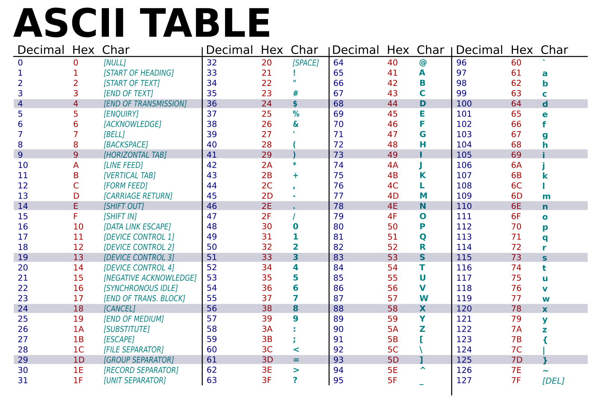

##   Queue
-  Creating a queue of integers
    queue<int> q;
q.push(x)	Adds element x to the back of the queue
q.pop()	Removes the front element (no return value)
q.front()	Returns reference to the front element
q.back()	Returns reference to the last (back) element
q.empty()	Returns true if the queue is empty
q.size()	Returns the number of elements in the queue
q.emplace(x)	Constructs and adds element at the back (in-place)
q.swap(q2)	Swaps contents with another queue q2

## ASCII
.
(	40
)	41
{	123
}	125
[	91
]	93.
