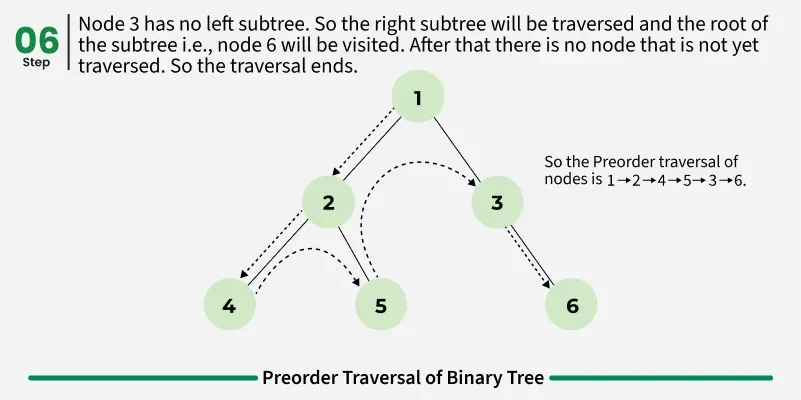
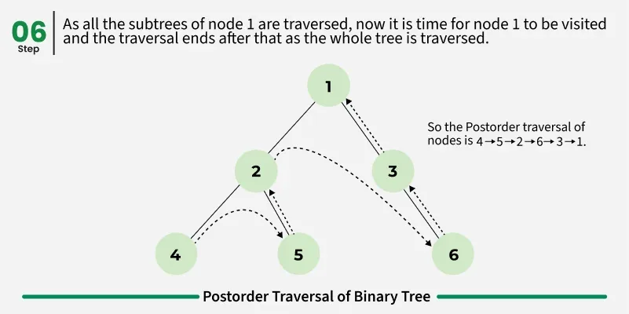

# stack
A Stack is a linear data structure that follows a particular order in which the operations are performed (LIFO) .
- syntax : stack<int>stk;

### Functions :
s.push(x)	Pushes element x on top of the stack
s.pop()	Removes the top element (no return value)
s.top()	Returns a reference to the top element
s.empty()	Returns true if the stack is empty
s.size()	Returns the number of elements in the stack
s.emplace(args...)	Constructs element in-place at the top
swap(s2)	Swaps contents with another stack

> 
complexity of all ops = O(1).
- ARRAYS : Address of ith Index = Base address + offset = Address of 0th Index + i × (size of one element) => O(1) again.

## Preorder Traversal of Binary Tree
Preorder traversal is a tree traversal method that follows the Root-Left-Right order:

The root node of the subtree is visited first.
Next, the left subtree is recursively traversed.
Finally, the right subtree is recursively traversed.

> ROOT -> LEFT -> RIGHT .

## Postorder traversal is a tree traversal method that follows the Left-Right-Root order:

The left subtree is visited first.
The right subtree is visited next.
The root node is processed last.

> LEFT -> RIGHT -> ROOT .

