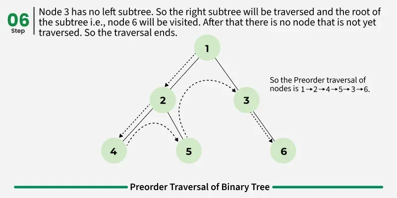

## Preorder Traversal of Binary Tree
Preorder traversal is a tree traversal method that follows the Root-Left-Right order:

The root node of the subtree is visited first.
Next, the left subtree is recursively traversed.
Finally, the right subtree is recursively traversed.

> ROOT -> LEFT -> RIGHT .

## Postorder traversal is a tree traversal method that follows the Left-Right-Root order:

The left subtree is visited first.
The right subtree is visited next.
The root node is processed last.

> LEFT -> RIGHT -> ROOT .